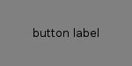
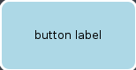
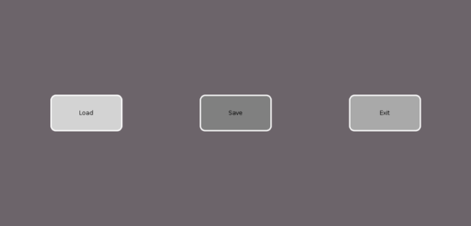
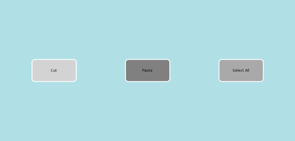

.. -*- coding: utf-8 -*-

ボタンとメニューの定義
======================

基本要素 - ボタン
-----------------

まずはボタン作りから、テキストエディタ作りを始めます。機能的には、マウスを気にする領域とラベルを、ボタンは持っています。ユーザーがボタンを押した時、ボタンはアクションを実行します。

QMLでは、基本の視覚要素は `Rectangle`_ 型です。 `QMLオブジェクト型`_ は `QMLプロパティ`_ を、それの見た目と位置をコントロールするために持っています。

.. _`Rectangle`: http://qt-project.org/doc/qt-5/qml-qtquick-rectangle.html
.. _`QMLオブジェクト型`: http://qt-project.org/doc/qt-5/qtqml-typesystem-objecttypes.html
.. _`QMLプロパティ`: http://qt-project.org/doc/qt-5/qtqml-syntax-propertybinding.html

.. code-block:: qml

   import QtQuick 2.0

   Rectangle {
       id: simpleButton
       color: "grey"
       width: 150; height: 75

       Text {
           id: buttonLabel
           anchors.centerIn: parent
           text: "button label"
       }
   }

まず、文 ``import QtQuick 2.0`` は、 `qmlscene`_ に、後で私達が使うQML型をインポートさせられます。
この行は、すべてのQMLファイルになければなりません。
``import`` 文に含まれるQtモジュールのバージョンに注意してください。

.. _`qmlscene`: http://qt-project.org/doc/qt-5/qtquick-qmlscene.html

この簡単な矩形は、 ``id`` プロパティに束縛された一意な識別子、 ``simpleButton`` を持っています。
この ``Rectangle`` オブジェクトのプロパティは、プロパティ、続いてコロン、そして値をリストすることで束縛されます。
サンプルコードでは、灰色が ``Rectangle`` の ``color`` プロパティに束縛されています。同様に、矩形の横幅と縦幅も束縛しています。

`Text`_ 型は、編集不可のテキストエリアです。私達はこのオブジェクトに ``buttonLabel`` と名づけました。
そのテキストエリアの中身の文字列をセットするため、私達は ``text`` プロパティに値を束縛しています。
それは ``Rectangle`` の範囲内に含まれ、そして中央に配置するために、 ``Text`` オブジェクトのアンカーを、親である ``simpleButton`` に割り当てています。アンカーは他の要素のアンカーへ束縛することが出来るので、レイアウトの割り当てがより簡単に出来ます。

.. _`Text`: http://qt-project.org/doc/qt-5/qml-qtquick-text.html

このコードを ``SimpleButton.qml`` として保存しましょう。 ``qmlscene`` をこのファイルを引数として渡して実行すると、灰色の矩形とテキストラベルが表示されるでしょう。

ボタンクリック機能を実装するには、QMLのイベント・ハンドリングが使えます。QMLのイベント・ハンドリングは `Qtのシグナル・アンド・スロット`_ 機構ととても似ています。シグナルが発行されると、つながっているスロットが呼ばれます。

.. _`Qtのシグナル・アンド・スロット`: http://qt-project.org/doc/qt-5/signalsandslots.html

.. code-block:: qml

   Rectangle {
       id: simpleButton
       ...
    
       MouseArea {
           id: buttonMouseArea
    
           // マウスエリアのすべての辺を矩形のアンカーにアンカーする
           anchors.fill: parent
           // onClicked は正しいマウスボタンクリックをハンドルする
           onClicked: console.log(buttonLabel.text + " clicked")
       }
    }

`MouseArea`_ オブジェクトを私達の ``simpleButton`` に入れます。
``MouseArea`` オブジェクトはマウスの動きが検出されるインタラクティブな領域を表します。
私達のボタンの場合、 ``MouseArea`` を親である ``simpleButton`` へとアンカーしています。
文 ``anchors.fill`` は、 ``anchors`` と呼ばれるプロパティのグループの内部の、 ``fill`` と呼ばれる明示的なプロパティへアクセスします。
QMLは、別の要素へアンカー出来る要素によるレイアウト、すなわちanchor-basedレイアウトを使い、強固なレイアウトを作成するのです。

.. _`MouseArea`: http://qt-project.org/doc/qt-5/qml-qtquick-mousearea.html

``MouseArea`` はたくさんのシグナル・ハンドラーを持っており、それらは定義した ``MouseArea`` 境界の内側でマウスが動く間ずっと呼ばれます。その一つが ``onClicked`` で、それは好ましいマウスボタン（デフォルトでは左クリック）がクリックされるたびに呼ばれます。そして、アクションをonClickedハンドラーに束縛できます。
私達の例では、マウスエリアがクリックされるたびに、 ``console.log()`` がテキストを出力します。
``console.log()`` はデバッグ目的でテキストを出力するのに便利です。

``SimpleButton.qml`` のコードは画面にボタンを表示して、それがマウスがクリックされた時にテキストを出力するのに十分です。

.. code-block:: qml

    Rectangle {
       id: button
       ...
    
       property color buttonColor: "lightblue"
       property color onHoverColor: "gold"
       property color borderColor: "white"
    
       signal buttonClick()
    
       onButtonClick: {
           console.log(buttonLabel.text + " clicked")
       }
    
       MouseArea{
           onClicked: buttonClick()
           hoverEnabled: true
           onEntered: parent.border.color = onHoverColor
           onExited:  parent.border.color = borderColor
       }
    
       // 条件演算子を使って、ボタンの色を決定する
       color: buttonMouseArea.pressed ? Qt.darker(buttonColor, 1.5) : buttonColor
    }

完全な機能を持つボタンが、 ``Button.qml`` です。この記事のコード片は楕円についてなど、いくつかのコードが省略されています。それは、今までの節で既に紹介しているか、今のコードの話には関係がないからです。

カスタムプロパティは、 ``property type name`` 文で宣言されます。コードでは、 ``color`` 型の ``buttonColor`` プロパティが宣言され、値 ``"lightblue"`` が束縛されています。 ``buttonColor`` はあとで、ボタンを塗りつぶす色を決定する条件つき命令で使われます。

.. note::
   プロパティ値は ``:`` コロン文字を使って束縛できるほか、 ``=`` イコール記号を使って代入することも出来ます [*]_ 。

カスタムプロパティのおかげで、 ``Rectangle`` のスコープ外から内部の値にアクセス出来ます。
``int``, ``string``, ``real``, ``variant`` と呼ばれる型も含む、そういった基本的な `QML型`_ が存在します。

シグナル・ハンドラー ``onEntered`` と ``onExited`` に色を束縛することで、ボタンの上をマウスホバーした時はボタンの枠線を黄色に変え、そのマウスエリアから出て行ったときは元の色に戻します。

シグナル ``buttonClick()`` は ``Button.qml`` で、キーワード ``signal`` をシグナル名の前に置くことで宣言されています。
すべてのシグナルは自動的に作られた ``on`` で始まる名前のハンドラーを持ちます。だから、 ``onButtonClick`` は、 ``buttonClick`` のハンドラーです。
``onButtonClick`` は、その後実行するアクションを割り当てられています。
私達のボタンの例では、 ``onClicked`` マウスハンドラは単純にテキストを表示する ``onButtonClick`` を呼び出します。
``onButtonClick`` は ``Button`` のマウスエリアへ簡単にアクセスするため、外側のオブジェクトを有効にします。
例えば、一つよりも多くの ``MouseArea`` の宣言とシグナル ``buttonClick`` を持つ要素で、それぞれの ``MouseArea`` の区別を付けるなら、シグナル・ハンドラーを使うのが良い。

今、私達には基本的なマウスの動きをハンドルするQMLの要素を実装するのに充分な基礎知識があります。
``Rectangle`` の内側に ``Text`` ラベルを入れ、それのプロパティのカスタマイズをし、マウスの動きに応じたふるまいを実装しました。QMLオブジェクトを入れることでQMLオブジェクトを作るという考え方は、テキストエディター・アプリケーションの場合でも繰り返されます。

このボタンは、アクションを実行するための構成として使われなければ使い物になりません。
次の節では、こうしたボタンをいくつか持つメニューを作ります。

.. [*] 訳注: 代入では、それが行われた際の値が割り当てられるのみですが、それに対して束縛では、束縛された変数の値に変更に追従します。この追従は他の変数が束縛されるか、新たな値が代入されるまで続きます。 :
       `QtQml 5.0: Property Binding | Documentation | Qt Project`_

.. _`QML型`: http://qt-project.org/doc/qt-5/qtqml-typesystem-basictypes.html
.. _`QtQml 5.0: Property Binding | Documentation | Qt Project`: http://qt-project.org/doc/qt-5.0/qtqml/qtqml-syntax-propertybinding.html

メニューページの作成
--------------------

ここまでは、唯一のQMLファイルの中で、どうやってオブジェクトを作り、ふるまいを割り当てるかについてカバーしました。この節では、どうやってQML型をインポートするか、どうやって作成したコンポーネントを他のコンポーネントから再利用するかについてカバーします。

メニューはリストの内容を表示し、各要素はアクションを実行する能力を持っています。QMLでは、様々な方法でメニューを作れます。まず、それぞれが異なるアクションをいずれ起こすボタンを含んでいるメニューを作ります。メニューのコードは ``FileMenu.qml`` にあります。

FileMenu.qmlより:

.. code-block:: qml

   Row {
        anchors.centerIn: parent
        spacing: parent.width / 6

        Button {
            id: loadButton
            buttonColor: "lightgrey"
            label: "Load"
        }
        Button {
            buttonColor: "grey"
            id: saveButton
            label: "Save"
        }
        Button {
            id: exitButton
            label: "Exit"
            buttonColor: "darkgrey"

            onButtonClick: Qt.quit()
        }
    }

``FileMenu.qml`` では、３つの ``Button`` オブジェクトを宣言しています。子を列に沿って配置するポジショナーである ``Row`` 型の内部で、それらは宣言されています。 ``Button`` の宣言は前の節で使った ``Button.qml`` に属している。新たに作ったボタンで新たなプロパティの束縛を宣言することで、効果的に ``Button.qml`` でセットされたプロパティを上書き出来ます。 ``exitButton`` と呼ばれるボタンはそれがクリックされた時、終了してウィンドウを閉じます。

.. note::
   ``exitButton`` のハンドラー ``onButtonClick`` に加え、 ``Button.qml`` にあるシグナル・ハンドラー ``onButtonClick`` も呼び出されます。

``Row`` は ``Rectangle`` の中で定義され、ボタンの列のための矩形のコンテナーを作っている。この付加的な矩形はメニューの内側にボタンの列を作る間接的な方法を作っています。

編集メニューの宣言はこの段階ではよく似ています。そのメニューは ``Copy`` 、 ``Paste`` 、 ``Select All`` ラベルをそれぞれ持つボタンを持ちます。

前もって作ったコンポーネントのインポートとカスタマイズについての知識を身に付けたので、これから、メニューバーを、コンポーネントを組み合わせて作りましょう。コンポーネントとは、複数のメニュー・ページのことで、そのメニュー・ページはそれぞれ、メニューの選択肢としての複数のボタンから成ります。まずはそれらを作ります。
また、QMLでデータを組み立てる方法も見て行きます。
